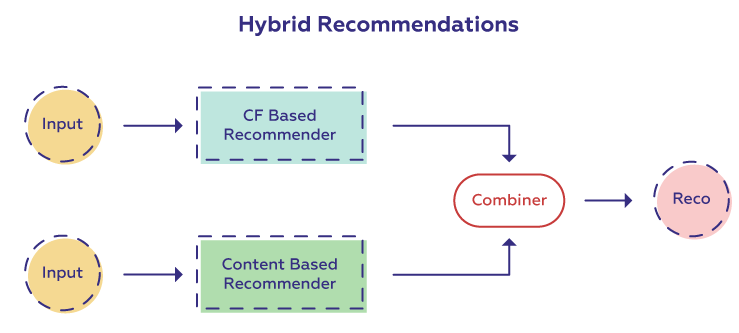

# Simple hybrid recommendation system

**Гибридная РС** — это особый тип рекомендательной системы, который представляет собой комбинацию из нескольких методов. Обычно это комбинация контентного подхода и коллаборативной фильтрации. Такое сочетание может помочь преодолеть недостатки, с которыми мы сталкиваемся при использовании этих методов по отдельности, а также в некоторых случаях может быть более эффективным.

Гибридные подходы к рекомендательным системам можно реализовать по-разному, например используя комбинацию из рекомендаций, полученных обеими системами, или используя взвешенную сумму предсказанных рейтингов.

Здесь мы попробуем создать рекомендательную систему с помощью гибридного подхода. Разумеется, можно комбинировать различные подходы самостоятельно, однако для удобства уже реализован модуль LightFM.

Работать мы будем с датасетом [goodreads_book](https://lms-cdn.skillfactory.ru/assets/courseware/v1/c977535583bf2f85a2d15617e672d8f4/asset-v1:SkillFactory+DSPR-2.0+14JULY2021+type@asset+block/Gooddreadbooks.zip).

*Goodreads* — это сайт, на котором люди могут добавлять книги в каталоги, искать их, изучать аннотации и отзывы. Пользователи также могут создавать сообщества, в которых они рекомендуют друг другу различную литературу, ведут блоги и устраивают обсуждения.
