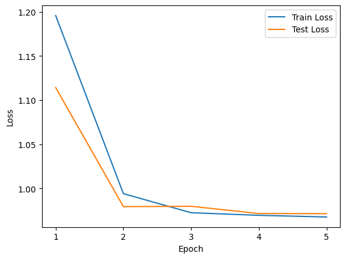
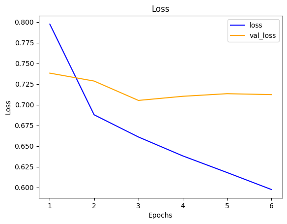

# Simple neural recommendation system

**Глубокое обучение (Deep Learning, DL)** — это современное и эффективное решение для многих задач машинного обучения, таких как компьютерное зрение или обработка естественного языка. Deep Learning во многих случаях превосходит классические методы, которые мы рассматривали ранее. Поэтому в последнее время глубокое обучение всё чаще применяется и в рекомендательных системах. Многие крупные компании, такие как AirBnB, Google, Home Depot, LinkedIn и Pinterest, используют рекомендательные системы, построенные именно на основе глубокого обучения.

Преимущества использования нейронных сетей:

- Как правило, DL-модели дают более высокое качество. Стандартные ML-модели проигрывают глубокому обучению, особенно в ситуациях с большим объёмом данных.
- DL-модели обладают большей гибкостью. В рамках одной можно получить ответы на такие вопросы, как «Добавит ли пользователь товар в корзину?», «Начнёт ли он оформление заказа с этим товаром?» или «Купит ли он этот товар?».
- Можно включать в модель данные совершенно разных типов, в т. ч. текстовые данные (используя на них инструменты NLP) или изображения (используя свёрточные нейронные сети).

Существует множество архитектур нейронных сетей, которые можно использовать для разработки рекомендательных систем. Но мы ограничимся здесь лишь самой простейшей — но реализованной на двух фреймворках для сравнения.

## Данные и метрика

Мы будем использовать данные из предыдущей работы (Gooddreadbooks), но лишь те, которые содержат информацию об оценках, выставленных книгам пользователями.

Особых метрик внедрят не будем, сравним модели по динамике ошибок MSE.

## Результат

Динамика loss-ов на обучении pytorch-модели:

Динамика loss-ов на обучении keras-модели:

Архитектура, оптимизация, loss-функции и размеры пакетов совпадают, но ощутимая разница всё же присутствует.

Код на keras мало того что куда проще, так ещё и позволил обучить для нашей задачи более качественную модель. Разумеется, наше сравнение не может служить приговором для всякой имплементации на pytorch — просто в данном случае оказалось так, что заложенное авторами в API к tensorflow сыграло лучше, чем собранный нами torch-конструктор. А какой-нибудь профи рассмотрев последний может и сказать что-то типа "а вы болты закрутить попробуйте".
